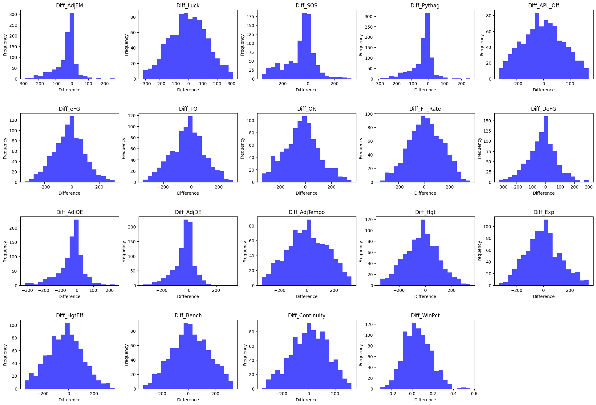
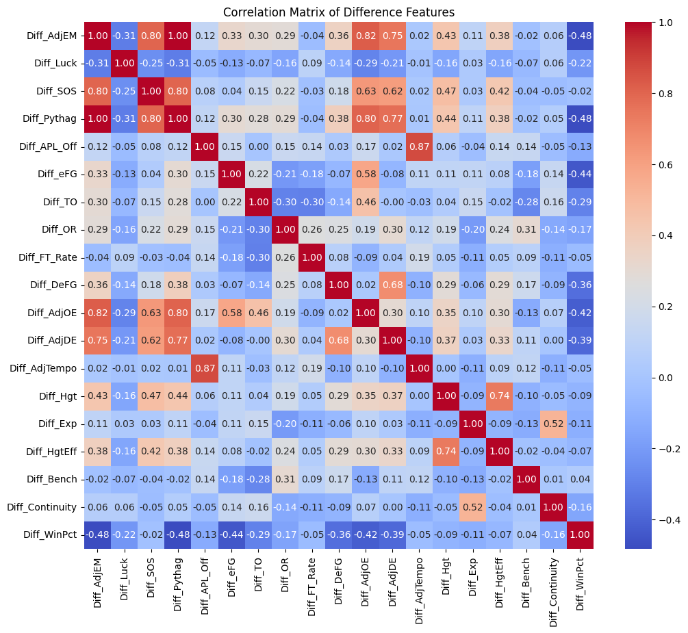
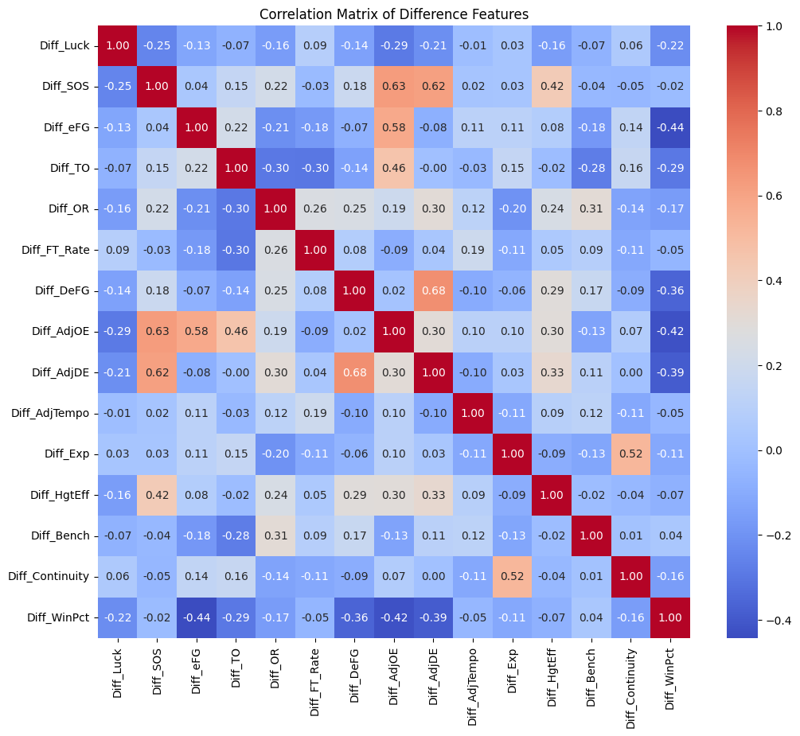
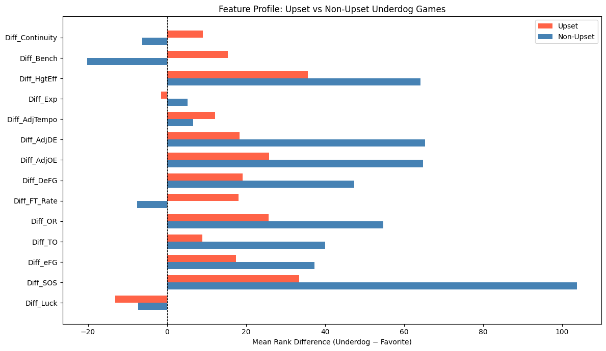
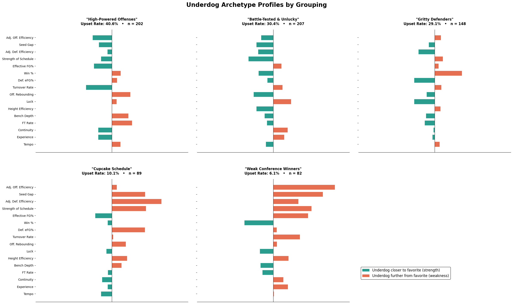
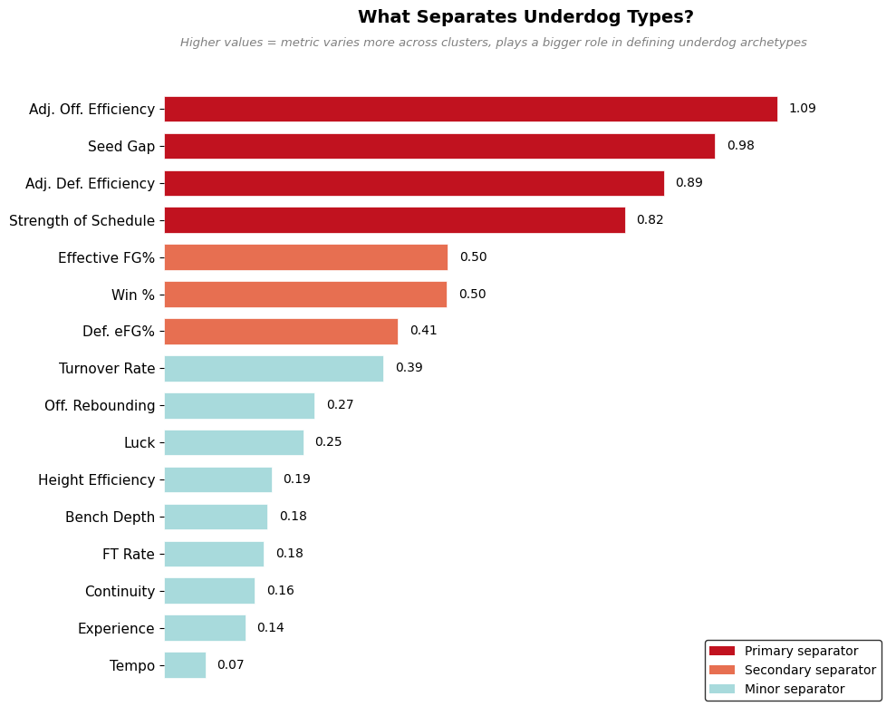

```python
# importing necessary libraries
import duckdb as ddb
import pandas as pd
import matplotlib.pyplot as plt
import numpy as np
import seaborn as sns
from sklearn.preprocessing import StandardScaler
from sklearn.cluster import KMeans
from sklearn.ensemble import RandomForestClassifier
from sklearn.metrics.pairwise import cosine_similarity
from sklearn.decomposition import PCA
from sklearn.metrics import silhouette_score
from scipy import stats
from matplotlib.patches import Patch
```


```python
# creating ddb connection
con = ddb.connect("march_madness.db")
```


```python
# reading in csv files and creating tables in ddb
con.execute("CREATE OR REPLACE TABLE teams AS SELECT * FROM read_csv_auto('../../data/clean/teams.csv')")
con.execute("CREATE OR REPLACE TABLE four_factors AS SELECT * FROM read_csv_auto('../../data/clean/four_factors.csv')")
con.execute("CREATE OR REPLACE TABLE height AS SELECT * FROM read_csv_auto('../../data/clean/height.csv')")
con.execute("CREATE OR REPLACE TABLE ratings AS SELECT * FROM read_csv_auto('../../data/clean/ratings.csv')")
con.execute("CREATE OR REPLACE TABLE tournament_games AS SELECT * FROM read_csv_auto('../../data/clean/tournament_games.csv')")
con.execute("CREATE OR REPLACE TABLE tournament_seeds AS SELECT * FROM read_csv_auto('../../data/clean/tournament_seeds.csv')")
```


    <duckdb.duckdb.DuckDBPyConnection at 0x107bcc130>


```python
# showing all tables (confirming that they were created successfully)
con.execute("SHOW TABLES").fetchall()
```


    [('four_factors',),
     ('height',),
     ('matchups',),
     ('ratings',),
     ('teams',),
     ('tournament_games',),
     ('tournament_seeds',)]


### Subsetting Features
- Selecting features that likely contribute to outcomes from tables
- Features selected from both winners and losers, joined to form matchups table
- Difference features calculated as difference between winning team - losing team
- Features selected from 2010 onwards for complete analysis, `ratings` data starts in 2010


```python
con.execute("""
    CREATE OR REPLACE TABLE matchups AS
    SELECT
        g.*,

        -- Winner ratings
        wr.RankAdjEM       AS W_RankAdjEM,
        wr.RankLuck        AS W_RankLuck,
        wr.RankSOS         AS W_RankSOS,
        wr.RankPythag      AS W_RankPythag,
        wr.RankAPL_Off     AS W_RankAPL_Off,

        -- Loser ratings
        lr.RankAdjEM       AS L_RankAdjEM,
        lr.RankLuck        AS L_RankLuck,
        lr.RankSOS         AS L_RankSOS,
        lr.RankPythag      AS L_RankPythag,
        lr.RankAPL_Off     AS L_RankAPL_Off,

        -- Winner four factors
        wf.RankeFG_Pct     AS W_RankeFG,
        wf.RankTO_Pct      AS W_RankTO,
        wf.RankOR_Pct      AS W_RankOR,
        wf.RankFT_Rate     AS W_RankFT_Rate,
        wf.RankDeFG_Pct    AS W_RankDeFG,
        wf.RankAdjOE       AS W_RankAdjOE,
        wf.RankAdjDE       AS W_RankAdjDE,
        wf.RankAdjTempo    AS W_RankAdjTempo,

        -- Loser four factors
        lf.RankeFG_Pct     AS L_RankeFG,
        lf.RankTO_Pct      AS L_RankTO,
        lf.RankOR_Pct      AS L_RankOR,
        lf.RankFT_Rate     AS L_RankFT_Rate,
        lf.RankDeFG_Pct    AS L_RankDeFG,
        lf.RankAdjOE       AS L_RankAdjOE,
        lf.RankAdjDE       AS L_RankAdjDE,
        lf.RankAdjTempo    AS L_RankAdjTempo,

        -- Winner height
        wh.AvgHgtRank      AS W_AvgHgtRank,
        wh.ExpRank         AS W_ExpRank,
        wh.HgtEffRank      AS W_HgtEffRank,
        wh.BenchRank       AS W_BenchRank,
        wh.RankContinuity  AS W_RankContinuity,

        -- Loser height
        lh.AvgHgtRank      AS L_AvgHgtRank,
        lh.ExpRank         AS L_ExpRank,
        lh.HgtEffRank      AS L_HgtEffRank,
        lh.BenchRank       AS L_BenchRank,
        lh.RankContinuity  AS L_RankContinuity,

        -- Difference features
        wr.RankAdjEM       - lr.RankAdjEM       AS Diff_AdjEM,
        wr.RankLuck        - lr.RankLuck        AS Diff_Luck,
        wr.RankSOS         - lr.RankSOS         AS Diff_SOS,
        wr.RankPythag      - lr.RankPythag      AS Diff_Pythag,
        wr.RankAPL_Off     - lr.RankAPL_Off     AS Diff_APL_Off,
        wf.RankeFG_Pct     - lf.RankeFG_Pct     AS Diff_eFG,
        wf.RankTO_Pct      - lf.RankTO_Pct      AS Diff_TO,
        wf.RankOR_Pct      - lf.RankOR_Pct      AS Diff_OR,
        wf.RankFT_Rate     - lf.RankFT_Rate     AS Diff_FT_Rate,
        wf.RankDeFG_Pct    - lf.RankDeFG_Pct    AS Diff_DeFG,
        wf.RankAdjOE       - lf.RankAdjOE       AS Diff_AdjOE,
        wf.RankAdjDE       - lf.RankAdjDE       AS Diff_AdjDE,
        wf.RankAdjTempo    - lf.RankAdjTempo    AS Diff_AdjTempo,
        wh.AvgHgtRank      - lh.AvgHgtRank      AS Diff_Hgt,
        wh.ExpRank         - lh.ExpRank          AS Diff_Exp,
        wh.HgtEffRank      - lh.HgtEffRank      AS Diff_HgtEff,
        wh.BenchRank       - lh.BenchRank        AS Diff_Bench,
        wh.RankContinuity  - lh.RankContinuity   AS Diff_Continuity,
            
        -- win percentages
        wr.Wins * 1.0 / (wr.Wins + wr.Losses) AS W_WinPct,
        lr.Wins * 1.0 / (lr.Wins + lr.Losses) AS L_WinPct,
        wr.Wins * 1.0 / (wr.Wins + wr.Losses) 
        - lr.Wins * 1.0 / (lr.Wins + lr.Losses) AS Diff_WinPct

    FROM tournament_games g

    INNER JOIN ratings      wr ON g.WTeamSeason = wr.TeamSeason
    INNER JOIN four_factors wf ON g.WTeamSeason = wf.TeamSeason
    INNER JOIN height       wh ON g.WTeamSeason = wh.TeamSeason

    INNER JOIN ratings      lr ON g.LTeamSeason = lr.TeamSeason
    INNER JOIN four_factors lf ON g.LTeamSeason = lf.TeamSeason
    INNER JOIN height       lh ON g.LTeamSeason = lh.TeamSeason

    WHERE g.Season >= 2010 AND g.Season < 2025
""")
```


    <duckdb.duckdb.DuckDBPyConnection at 0x107bcc130>


```python
# creating dataframe from matchups table for analysis
matchups_df = con.execute("SELECT * FROM matchups").fetchdf()
```


```python
# viewing the matchups table
con.execute("SELECT * FROM matchups LIMIT 5").fetchdf()
```


<div>
<style scoped>
    .dataframe tbody tr th:only-of-type {
        vertical-align: middle;
    }

    .dataframe tbody tr th {
        vertical-align: top;
    }

    .dataframe thead th {
        text-align: right;
    }
</style>
<table border="1" class="dataframe">
  <thead>
    <tr style="text-align: right;">
      <th></th>
      <th>GameID</th>
      <th>Season</th>
      <th>WTeamID</th>
      <th>WScore</th>
      <th>LTeamID</th>
      <th>LScore</th>
      <th>WSeed</th>
      <th>WTeamName</th>
      <th>LSeed</th>
      <th>LTeamName</th>
      <th>...</th>
      <th>Diff_AdjDE</th>
      <th>Diff_AdjTempo</th>
      <th>Diff_Hgt</th>
      <th>Diff_Exp</th>
      <th>Diff_HgtEff</th>
      <th>Diff_Bench</th>
      <th>Diff_Continuity</th>
      <th>W_WinPct</th>
      <th>L_WinPct</th>
      <th>Diff_WinPct</th>
    </tr>
  </thead>
  <tbody>
    <tr>
      <th>0</th>
      <td>468</td>
      <td>2010</td>
      <td>1181</td>
      <td>73</td>
      <td>1115</td>
      <td>44</td>
      <td>1</td>
      <td>Duke</td>
      <td>16</td>
      <td>Arkansas Pine Bluff</td>
      <td>...</td>
      <td>-102</td>
      <td>14</td>
      <td>-251</td>
      <td>-102</td>
      <td>-255</td>
      <td>193</td>
      <td>75</td>
      <td>0.875000</td>
      <td>0.529412</td>
      <td>0.345588</td>
    </tr>
    <tr>
      <th>1</th>
      <td>508</td>
      <td>2010</td>
      <td>1181</td>
      <td>78</td>
      <td>1124</td>
      <td>71</td>
      <td>1</td>
      <td>Duke</td>
      <td>3</td>
      <td>Baylor</td>
      <td>...</td>
      <td>-38</td>
      <td>-6</td>
      <td>-19</td>
      <td>-35</td>
      <td>5</td>
      <td>-1</td>
      <td>-111</td>
      <td>0.875000</td>
      <td>0.777778</td>
      <td>0.097222</td>
    </tr>
    <tr>
      <th>2</th>
      <td>512</td>
      <td>2010</td>
      <td>1181</td>
      <td>61</td>
      <td>1139</td>
      <td>59</td>
      <td>1</td>
      <td>Duke</td>
      <td>5</td>
      <td>Butler</td>
      <td>...</td>
      <td>-2</td>
      <td>-57</td>
      <td>-236</td>
      <td>-43</td>
      <td>-288</td>
      <td>-4</td>
      <td>109</td>
      <td>0.875000</td>
      <td>0.868421</td>
      <td>0.006579</td>
    </tr>
    <tr>
      <th>3</th>
      <td>484</td>
      <td>2010</td>
      <td>1243</td>
      <td>84</td>
      <td>1140</td>
      <td>72</td>
      <td>2</td>
      <td>Kansas St.</td>
      <td>7</td>
      <td>BYU</td>
      <td>...</td>
      <td>-25</td>
      <td>21</td>
      <td>73</td>
      <td>-39</td>
      <td>-29</td>
      <td>77</td>
      <td>18</td>
      <td>0.783784</td>
      <td>0.833333</td>
      <td>-0.049550</td>
    </tr>
    <tr>
      <th>4</th>
      <td>491</td>
      <td>2010</td>
      <td>1181</td>
      <td>68</td>
      <td>1143</td>
      <td>53</td>
      <td>1</td>
      <td>Duke</td>
      <td>8</td>
      <td>California</td>
      <td>...</td>
      <td>-71</td>
      <td>122</td>
      <td>-146</td>
      <td>13</td>
      <td>-106</td>
      <td>54</td>
      <td>93</td>
      <td>0.875000</td>
      <td>0.685714</td>
      <td>0.189286</td>
    </tr>
  </tbody>
</table>
<p>5 rows × 72 columns</p>
</div>


## EDA


```python
# removing 16 seed v 16 seed matchups (first four, no upsets possible)
matchups_df = matchups_df[~((matchups_df.WSeed == 16) & (matchups_df.LSeed == 16))]

# checking the shape of the matchups dataframe and printing out the difference features
diff_cols = [c for c in matchups_df.columns if c.startswith("Diff_")]
print(f"\nShape: {matchups_df.shape}")
print(f"Diff features ({len(diff_cols)}): {diff_cols}")
```

    
    Shape: (902, 72)
    Diff features (19): ['Diff_AdjEM', 'Diff_Luck', 'Diff_SOS', 'Diff_Pythag', 'Diff_APL_Off', 'Diff_eFG', 'Diff_TO', 'Diff_OR', 'Diff_FT_Rate', 'Diff_DeFG', 'Diff_AdjOE', 'Diff_AdjDE', 'Diff_AdjTempo', 'Diff_Hgt', 'Diff_Exp', 'Diff_HgtEff', 'Diff_Bench', 'Diff_Continuity', 'Diff_WinPct']


### Checking that data types are all correct, no missing values in important fields


```python
# there should be no missing data in difference features
null_counts = matchups_df[diff_cols].isnull().sum()
if null_counts.sum() > 0:
    print("\nNull values found in difference features:")
    print(null_counts[null_counts > 0])
else:
    print("\nNo null values found in difference features")

# diff cols should be numeric
diff_types = matchups_df[diff_cols].dtypes
if all(np.issubdtype(dtype, np.number) for dtype in diff_types):
    print("\nAll difference features are numeric")
else:
    print("\nDifference features have varying data types:")
    print(diff_types)

# 'Upset' column should be binary (0 or 1) and of type int64
if (matchups_df['Upset'].dtype == 'int64' and matchups_df['Upset'].isin([0, 1]).all()):
    print("\nUpset column is binary")
else: 
    print("\nUpset column is not binary or not of type int64")
```

    
    No null values found in difference features
    
    All difference features are numeric
    
    Upset column is binary


```python
# generating histograms for difference features in one plot
num_cols = len(diff_cols)
cols_per_row = 5
num_rows = (num_cols + cols_per_row - 1) // cols_per_row
plt.figure(figsize=(24, num_rows * 4))
for i, col in enumerate(diff_cols):
    plt.subplot(num_rows, cols_per_row, i + 1)
    plt.hist(matchups_df[col], bins=20, color='blue', alpha=0.7)
    # adding vertical padding for space between plots
    plt.subplots_adjust(hspace=0.5)  # Adjust the value as needed for more or less space
    plt.title(col)
    plt.xlabel('Difference')
    plt.ylabel('Frequency')
```


    

    


- Diff AdjEM, AdjDE, AdjOE, SOS, and Pythag are pretty skewed
- This indicates that they are the biggest difference between teams that win and lose
- Must be conscious of this in feature selection and analysis

## Feature Selection


```python
# correlation matrix of features
plt.figure(figsize=(12, 10))
sns.heatmap(matchups_df[diff_cols].corr(), annot=True, fmt=".2f", cmap="coolwarm")
plt.title("Correlation Matrix of Difference Features")
plt.show()
```


    

    


Not including highly correlated features in model
- Removing ADJ_EM as it is calculated based off of offensive and defensive efficiency
- Removing Pythag because it is calculated based off of efficiency as well
- Removing diff_hgt because effective height is highly correlated and more telling
- Removing average possession length because it is highly correlated with tempo 


```python
features = [
    # Ratings
    "Diff_Luck",
    "Diff_SOS",

    # Four Factors
    "Diff_eFG",
    "Diff_TO",
    "Diff_OR",
    "Diff_FT_Rate",
    "Diff_DeFG",
    "Diff_AdjOE",
    "Diff_AdjDE",
    "Diff_AdjTempo",

    # Height / Roster
    "Diff_Exp",
    "Diff_HgtEff",
    "Diff_Bench",
    "Diff_Continuity",
    
    # Regular season record
    "Diff_WinPct"]

# splitting into features, target
X = matchups_df[features]
y = matchups_df["Upset"]

# ensuring correct size, no missing data
print(f"Features: {len(features)}")
print(f"Samples: {len(y)}")
print(f"\nNull counts:\n{X.isnull().sum()}")
```

    Features: 15
    Samples: 902
    
    Null counts:
    Diff_Luck          0
    Diff_SOS           0
    Diff_eFG           0
    Diff_TO            0
    Diff_OR            0
    Diff_FT_Rate       0
    Diff_DeFG          0
    Diff_AdjOE         0
    Diff_AdjDE         0
    Diff_AdjTempo      0
    Diff_Exp           0
    Diff_HgtEff        0
    Diff_Bench         0
    Diff_Continuity    0
    Diff_WinPct        0
    dtype: int64


```python
# re-checking for co-linearity based on selected features
plt.figure(figsize=(12, 10))
sns.heatmap(X.corr(), annot=True, fmt=".2f", cmap="coolwarm")
plt.title("Correlation Matrix of Difference Features")
plt.show()
```


    

    


No longer any features that are concerningly highly correlated

## Preparing Data for Modeling

- When initially modeling was conducted, there was data leakage from the input format
- Data was formatted as winner vs. loser and upset could be detected
- Instead formatting as higher v. lower seed below


```python
# favorite vs. underdog instead of winner v. loser 
matchups_reframed = matchups_df.copy()

# Identify which team is the favorite (lower seed number = better seed)
fav_is_winner = matchups_reframed["WSeed"] <= matchups_reframed["LSeed"]

# Underdog stats minus Favorite stats
for col in features:
    w_col = col.replace("Diff_", "W_Rank").replace("Diff_", "")
    # flipping sign when favorite is the winner to get underdog minus favorite
    matchups_reframed[col] = np.where(fav_is_winner, -matchups_df[col], matchups_df[col])

# adding in favorite and underdog seed and team name for reference
matchups_reframed["Fav_Seed"] = np.where(fav_is_winner, matchups_df["WSeed"], matchups_df["LSeed"])
matchups_reframed["Dog_Seed"] = np.where(fav_is_winner, matchups_df["LSeed"], matchups_df["WSeed"])
matchups_reframed["Fav_Team"] = np.where(fav_is_winner, matchups_df["WTeamName"], matchups_df["LTeamName"])
matchups_reframed["Dog_Team"] = np.where(fav_is_winner, matchups_df["LTeamName"], matchups_df["WTeamName"])
matchups_reframed["SeedDiff"] = matchups_reframed["Dog_Seed"] - matchups_reframed["Fav_Seed"]

# Target: did the underdog win? (= upset)
matchups_reframed["Upset"] = matchups_df["Upset"]

# Add SeedDiff as a feature
features_with_seed = features + ["SeedDiff"]
matchups_reframed["SeedDiff"] = matchups_reframed["Dog_Seed"] - matchups_reframed["Fav_Seed"]
X = matchups_reframed[features_with_seed]
y = matchups_reframed["Upset"]

# Means should be mainly positive since we are doing underdog minus favorite (lower rank --> better)
print(X.mean().round(2))
print(f"\nUpset rate: {y.mean():.2%}")
```

    Diff_Luck          -5.49
    Diff_SOS           68.71
    Diff_eFG           27.88
    Diff_TO            28.12
    Diff_OR            40.03
    Diff_FT_Rate       -0.62
    Diff_DeFG          34.30
    Diff_AdjOE         44.89
    Diff_AdjDE         42.79
    Diff_AdjTempo       9.11
    Diff_Exp            0.63
    Diff_HgtEff        48.31
    Diff_Bench         -9.58
    Diff_Continuity    -0.93
    Diff_WinPct        -0.07
    SeedDiff            6.28
    dtype: float64
    
    Upset rate: 22.39%


- Upsets occurs in a bit less than 1/4 of games overall
- Mainly positive differences for higher seeded teams (other than luck, bench utilization, actually lower win %)

Subsetting for just Underdogs (seed diff more than 1)


```python
underdogs = matchups_reframed[matchups_reframed["SeedDiff"].abs() > 1].copy()

print(f"\nTotal matchups: {len(matchups_reframed)}")
print(f"Underdog matchups (|SeedDiff| > 1): {len(underdogs)}")
print(f"Upsets: {(underdogs['Upset'] == 1).sum()}  |  Non-Upsets: {(underdogs['Upset'] == 0).sum()}")
```

    
    Total matchups: 902
    Underdog matchups (|SeedDiff| > 1): 728
    Upsets: 202  |  Non-Upsets: 526


## Upset vs. Non-Upset Differences


```python
upset_games = underdogs.loc[underdogs["Upset"] == 1, features_with_seed]
non_upset_games = underdogs.loc[underdogs["Upset"] == 0, features_with_seed]

# gathering summary statistics for upsets vs. non
summary_upset = upset_games.describe().T[["mean", "50%", "std"]]
summary_non_upset = non_upset_games.describe().T[["mean", "50%", "std"]]

summary_upset.columns  = ["Upset_Mean", "Upset_Median", "Upset_Std"]
summary_non_upset.columns = ["NonUpset_Mean", "NonUpset_Median", "NonUpset_Std"]

# adding seed diff
comparison = pd.concat([summary_upset, summary_non_upset], axis=1)
comparison["Mean_Diff"] = comparison["Upset_Mean"] - comparison["NonUpset_Mean"]

print("\n── Profile Comparison: Upset vs Non-Upset Underdogs ──")
print(comparison.round(2).to_string())
```

    
    ── Profile Comparison: Upset vs Non-Upset Underdogs ──
                     Upset_Mean  Upset_Median  Upset_Std  NonUpset_Mean  NonUpset_Median  NonUpset_Std  Mean_Diff
    Diff_Luck            -13.06         -7.00     133.61          -7.23            -11.5        125.92      -5.83
    Diff_SOS              33.51         13.00      80.90         103.77             76.0        108.05     -70.26
    Diff_eFG              17.52         16.50     110.88          37.29             29.0        110.32     -19.77
    Diff_TO                9.00         -1.00     114.62          40.01             31.0        117.07     -31.01
    Diff_OR               25.69         26.00     131.90          54.72             49.0        127.97     -29.02
    Diff_FT_Rate          18.08         11.50     125.77          -7.59            -12.0        131.11      25.67
    Diff_DeFG             19.11         13.00      95.08          47.46             38.0         94.25     -28.35
    Diff_AdjOE            25.80         20.00      55.27          64.76             43.0         75.35     -38.97
    Diff_AdjDE            18.35         14.00      52.47          65.29             47.0         74.88     -46.94
    Diff_AdjTempo         12.19          5.00     150.41           6.66              7.0        150.39       5.53
    Diff_Exp              -1.53         -5.00     124.78           5.19              5.0        127.76      -6.72
    Diff_HgtEff           35.68         37.50     133.55          64.18             66.5        127.56     -28.50
    Diff_Bench            15.41         12.00     139.87         -20.21            -16.5        133.59      35.62
    Diff_Continuity        9.09         12.50     135.89          -6.32            -13.0        135.75      15.42
    Diff_WinPct           -0.04         -0.05       0.10          -0.10             -0.1          0.13       0.06
    SeedDiff               6.16          5.00       2.81           8.13              8.0          3.84      -1.97


```python
# removing seed diff and win %, different scales
plotting_features = [feat for feat in features_with_seed if feat not in ["SeedDiff", "Diff_WinPct"]]
comparison_plot = comparison.loc[plotting_features]

fig, ax = plt.subplots(figsize=(12, 7))
x = range(len(plotting_features))
width = 0.35
ax.barh([i + width/2 for i in x], comparison_plot["Upset_Mean"], width, label="Upset", color="tomato")
ax.barh([i - width/2 for i in x], comparison_plot["NonUpset_Mean"], width, label="Non-Upset", color="steelblue")
ax.set_yticks(list(x))
ax.set_yticklabels(plotting_features)
ax.set_xlabel("Mean Rank Difference (Underdog − Favorite)")
ax.set_title("Feature Profile: Upset vs Non-Upset Underdog Games")
ax.legend()
ax.axvline(0, color="black", linewidth=0.8, linestyle="--")
plt.tight_layout()
plt.show()
```


    

    


The biggest differences between upsets and non-upsets are
- Strength of Schedule: Teams that upset have an average of 70 ranks harder SOS than non-upset teams
- Adjusted Defensive Efficiency: Teams that upset have an average of 47 ranks higher adjusted defensive efficiency than non-upset teams
- Bench Utilization: Teams that upset use their bench an average of 36 ranks less than non-upset teams
- Turnover Difference: Teams that upset are ranked 31 slots higher, on average, in turnover differential than non-upset teams
- Teams that upset are approximately 2 seeds higher, on average, than non-upset teams

## Modeling

### Performing Clustering


```python
# scaling features so Kmeans treats with equal importance
scaler = StandardScaler()
X_scaled = scaler.fit_transform(underdogs[features_with_seed])

kmeans = KMeans(n_clusters=5, random_state=42, n_init=10)
underdogs = underdogs.copy()
underdogs["Cluster"] = kmeans.fit_predict(X_scaled)

# Cluster upset rates
cluster_summary = underdogs.groupby("Cluster").agg(
    n_games=("Upset", "count"),
    n_upsets=("Upset", "sum"),
    upset_rate=("Upset", "mean")
).reset_index()
cluster_summary["upset_rate_pct"] = (cluster_summary["upset_rate"] * 100).round(1)

# Cluster centers
cluster_zscores = pd.DataFrame(kmeans.cluster_centers_, columns=features_with_seed)
cluster_zscores.index.name = "Cluster"

# transforming cluster centers back to original scale for interpretation
cluster_profiles = pd.DataFrame(
    scaler.inverse_transform(kmeans.cluster_centers_),
    columns=features_with_seed
).round(2)
cluster_profiles.index.name = "Cluster"
```

### Generating Labels for Clusters


```python
# more interpretable feature names
label_map = {
    "Diff_Luck": "Luck", "Diff_SOS": "Strength of Schedule",
    "Diff_eFG": "Effective FG%", "Diff_TO": "Turnover Rate",
    "Diff_OR": "Off. Rebounding", "Diff_FT_Rate": "FT Rate",
    "Diff_DeFG": "Def. eFG%", "Diff_AdjOE": "Adj. Off. Efficiency",
    "Diff_AdjDE": "Adj. Def. Efficiency", "Diff_AdjTempo": "Tempo",
    "Diff_Exp": "Experience", "Diff_HgtEff": "Height Efficiency",
    "Diff_Bench": "Bench Depth", "Diff_Continuity": "Continuity",
 "Diff_WinPct": "Win %", "SeedDiff": "Seed Gap"
}

# looping over clusters, looking at top 3 defining features, labeling (based on z-scores)
cluster_descriptions = {}
for cid in range(kmeans.n_clusters):
    row = cluster_zscores.loc[cid]
    top = row.abs().sort_values(ascending=False).head(3)
    
    strengths = []
    weaknesses = []
    for feat in top.index:
        name = label_map.get(feat, feat)
        # For rank-based features: negative z = underdog ranked BETTER than avg favorite (strength)
        if feat in ["Diff_WinPct"]:
            if row[feat] > 0:
                strengths.append(name)
            else:
                weaknesses.append(name)
        elif feat == "SeedDiff":
            if row[feat] > 0:
                weaknesses.append(f"Large {name}")
            else:
                strengths.append(f"Small {name}")
        else:
            # Rank diffs: negative = underdog closer to favorite
            if row[feat] < 0:
                strengths.append(name)
            else:
                weaknesses.append(name)
    
    # formatting text description
    parts = []
    if strengths:
        parts.append("Strong: " + ", ".join(strengths))
    if weaknesses:
        parts.append("Weak: " + ", ".join(weaknesses))
    
    desc = "\n".join(parts)
    cluster_descriptions[cid] = desc

print("── Cluster Descriptions ──")
for cid, desc in cluster_descriptions.items():
    print(f"\nCluster {cid} (n={cluster_summary.loc[cid, 'n_games']}, "
          f"upset={cluster_summary.loc[cid, 'upset_rate_pct']}%):")
    print(f"  {desc}")
```

    ── Cluster Descriptions ──
    
    Cluster 0 (n=148, upset=29.1%):
      Strong: Win %, Luck, Def. eFG%
    
    Cluster 1 (n=89, upset=10.1%):
      Weak: Adj. Def. Efficiency, Strength of Schedule, Large Seed Gap
    
    Cluster 2 (n=82, upset=6.1%):
      Weak: Adj. Off. Efficiency, Large Seed Gap, Strength of Schedule
    
    Cluster 3 (n=202, upset=40.6%):
      Strong: Turnover Rate, Adj. Off. Efficiency
    Weak: FT Rate
    
    Cluster 4 (n=207, upset=30.4%):
      Strong: Strength of Schedule, Off. Rebounding
    Weak: Luck


### EXAMPLE GAMES PER CLUSTER


```python
display_cols = ["Season", "Dog_Team", "Dog_Seed", "Fav_Team", "Fav_Seed", "Upset", "Cluster"]

# outputting example games from each cluster to illustrate the profiles (sorted by most recent season)
print("\n── Example Games Per Cluster ──")
for cid in range(kmeans.n_clusters):
    cluster_games = underdogs[underdogs["Cluster"] == cid].sort_values("Season", ascending=False)
    n_show = min(10, len(cluster_games))
    print(f"\n{'='*70}")
    print(f"CLUSTER {cid}: {cluster_descriptions[cid]}")
    print(f"Upset Rate: {cluster_summary.loc[cid, 'upset_rate_pct']}% | "
          f"Games: {cluster_summary.loc[cid, 'n_games']}")
    print(f"{'='*70}")
    print(cluster_games[display_cols].head(n_show).to_string(index=False))

```

    
    ── Example Games Per Cluster ──
    
    ======================================================================
    CLUSTER 0: Strong: Win %, Luck, Def. eFG%
    Upset Rate: 29.1% | Games: 148
    ======================================================================
     Season      Dog_Team  Dog_Seed  Fav_Team  Fav_Seed  Upset  Cluster
       2024 James Madison        12 Wisconsin         5      1        0
       2024   McNeese St.        12   Gonzaga         5      0        0
       2024      Duquesne        11       BYU         6      1        0
       2024       Colgate        14    Baylor         3      0        0
       2024    N.C. State        11      Duke         4      1        0
       2024      Duquesne        11  Illinois         3      0        0
       2024 James Madison        12      Duke         4      0        0
       2024       Oakland        14  Kentucky         3      1        0
       2024  Grand Canyon        12   Alabama         4      0        0
       2024  Morehead St.        14  Illinois         3      0        0
    
    ======================================================================
    CLUSTER 1: Weak: Adj. Def. Efficiency, Strength of Schedule, Large Seed Gap
    Upset Rate: 10.1% | Games: 89
    ======================================================================
     Season               Dog_Team  Dog_Seed         Fav_Team  Fav_Seed  Upset  Cluster
       2024                    UAB        12    San Diego St.         5      0        1
       2024                Stetson        16      Connecticut         1      0        1
       2024       South Dakota St.        15         Iowa St.         2      0        1
       2023    Fairleigh Dickinson        16           Purdue         1      1        1
       2023                Colgate        15            Texas         2      0        1
       2023                 Furman        13    San Diego St.         5      0        1
       2023              Louisiana        13        Tennessee         4      0        1
       2023    Fairleigh Dickinson        16 Florida Atlantic         9      0        1
       2023 Texas A&M Corpus Chris        16          Alabama         1      0        1
       2023          UNC Asheville        15             UCLA         2      0        1
    
    ======================================================================
    CLUSTER 2: Weak: Adj. Off. Efficiency, Large Seed Gap, Strength of Schedule
    Upset Rate: 6.1% | Games: 82
    ======================================================================
     Season          Dog_Team  Dog_Seed       Fav_Team  Fav_Seed  Upset  Cluster
       2024  Western Kentucky        15      Marquette         2      0        2
       2024            Wagner        16 North Carolina         1      0        2
       2024     Saint Peter's        15      Tennessee         2      0        2
       2024          Longwood        16        Houston         1      0        2
       2024    Long Beach St.        15        Arizona         2      0        2
       2024     Grambling St.        16         Purdue         1      0        2
       2024             Akron        14      Creighton         3      0        2
       2023 Northern Kentucky        16        Houston         1      0        2
       2023            Howard        16         Kansas         1      0        2
       2022              Yale        14         Purdue         3      0        2
    
    ======================================================================
    CLUSTER 3: Strong: Turnover Rate, Adj. Off. Efficiency
    Weak: FT Rate
    Upset Rate: 40.6% | Games: 202
    ======================================================================
     Season     Dog_Team  Dog_Seed       Fav_Team  Fav_Seed  Upset  Cluster
       2024         Yale        13  San Diego St.         5      0        3
       2024     Colorado        10        Florida         7      1        3
       2024      Clemson         6        Arizona         2      1        3
       2024         Yale        13         Auburn         4      1        3
       2024      Clemson         6         Baylor         3      1        3
       2024      Clemson         6        Alabama         4      0        3
       2024       Dayton         7        Arizona         2      0        3
       2024        Drake        10 Washington St.         7      0        3
       2024 Colorado St.        10          Texas         7      0        3
       2024      Gonzaga         5         Purdue         1      0        3
    
    ======================================================================
    CLUSTER 4: Strong: Strength of Schedule, Off. Rebounding
    Weak: Luck
    Upset Rate: 30.4% | Games: 207
    ======================================================================
     Season       Dog_Team  Dog_Seed       Fav_Team  Fav_Seed  Upset  Cluster
       2024 Washington St.         7       Iowa St.         2      0        4
       2024        Alabama         4 North Carolina         1      1        4
       2024        Alabama         4    Connecticut         1      0        4
       2024       Colorado        10      Marquette         2      0        4
       2024           Duke         4        Houston         1      1        4
       2024       Illinois         3    Connecticut         1      0        4
       2024     N.C. State        11      Marquette         2      1        4
       2024     New Mexico        11        Clemson         6      0        4
       2024         Oregon        11      Creighton         3      0        4
       2024  San Diego St.         5    Connecticut         1      0        4


```python
# finding average seed for each cluster (of underdog)
cluster_seed_summary = underdogs.groupby("Cluster").agg(
    avg_dog_seed=("Dog_Seed", "mean"),
    avg_fav_seed=("Fav_Seed", "mean"),
    avg_seed_diff=("SeedDiff", "mean")
).round(2)
```


```python
cluster_seed_summary
```


<div>
<style scoped>
    .dataframe tbody tr th:only-of-type {
        vertical-align: middle;
    }

    .dataframe tbody tr th {
        vertical-align: top;
    }

    .dataframe thead th {
        text-align: right;
    }
</style>
<table border="1" class="dataframe">
  <thead>
    <tr style="text-align: right;">
      <th></th>
      <th>avg_dog_seed</th>
      <th>avg_fav_seed</th>
      <th>avg_seed_diff</th>
    </tr>
    <tr>
      <th>Cluster</th>
      <th></th>
      <th></th>
      <th></th>
    </tr>
  </thead>
  <tbody>
    <tr>
      <th>0</th>
      <td>11.14</td>
      <td>4.28</td>
      <td>6.85</td>
    </tr>
    <tr>
      <th>1</th>
      <td>14.38</td>
      <td>2.76</td>
      <td>11.62</td>
    </tr>
    <tr>
      <th>2</th>
      <td>15.34</td>
      <td>1.74</td>
      <td>13.60</td>
    </tr>
    <tr>
      <th>3</th>
      <td>9.61</td>
      <td>3.61</td>
      <td>6.00</td>
    </tr>
    <tr>
      <th>4</th>
      <td>8.68</td>
      <td>3.14</td>
      <td>5.55</td>
    </tr>
  </tbody>
</table>
</div>


There are clearly differences in seed for each cluster. Cluster 2(with an upset rate of 6.1%) has an average seed of 15.34, indicating that this is likely mainly 15/16 seeds with virtually no chance of winning

### Defining Features/Games in clusters


```python
print("\n── Top 5 Defining Features Per Cluster ──")
for cid in range(kmeans.n_clusters):
    row = cluster_zscores.loc[cid]
    top = row.abs().sort_values(ascending=False).head(5)
    print(f"\nCluster {cid} (n={cluster_summary.loc[cid, 'n_games']}, "
          f"upset rate={cluster_summary.loc[cid, 'upset_rate_pct']}%):")
    for feat in top.index:
        direction = "↑" if row[feat] > 0 else "↓"
        print(f"  {direction} {label_map.get(feat, feat)}: {row[feat]:.2f}")
print("\n\n" + "="*80)
print("FULL GAME LISTINGS BY CLUSTER")
print("="*80)

for cid in range(kmeans.n_clusters):
    cluster_games = underdogs[underdogs["Cluster"] == cid].sort_values(
        ["Season", "Upset"], ascending=[False, False]
    )
    print(f"\n{'─'*80}")
    print(f"CLUSTER {cid} | {cluster_descriptions[cid]}")
    print(f"Upset Rate: {cluster_summary.loc[cid, 'upset_rate_pct']}% | "
          f"Total: {cluster_summary.loc[cid, 'n_games']} games | "
          f"Upsets: {cluster_summary.loc[cid, 'n_upsets']}")
    print(f"{'─'*80}")
    print(cluster_games[display_cols].to_string(index=False))
```

    
    ── Top 5 Defining Features Per Cluster ──
    
    Cluster 0 (n=148, upset rate=29.1%):
      ↑ Win %: 0.89
      ↓ Luck: -0.67
      ↓ Def. eFG%: -0.67
      ↓ Adj. Def. Efficiency: -0.53
      ↓ FT Rate: -0.33
    
    Cluster 1 (n=89, upset rate=10.1%):
      ↑ Adj. Def. Efficiency: 1.62
      ↑ Strength of Schedule: 1.12
      ↑ Seed Gap: 1.09
      ↑ Def. eFG%: 1.08
      ↓ Effective FG%: -0.55
    
    Cluster 2 (n=82, upset rate=6.1%):
      ↑ Adj. Off. Efficiency: 2.02
      ↑ Seed Gap: 1.63
      ↑ Strength of Schedule: 1.25
      ↑ Effective FG%: 1.14
      ↓ Win %: -0.95
    
    Cluster 3 (n=202, upset rate=40.6%):
      ↓ Turnover Rate: -0.85
      ↑ FT Rate: 0.66
      ↓ Adj. Off. Efficiency: -0.63
      ↑ Off. Rebounding: 0.61
      ↓ Effective FG%: -0.59
    
    Cluster 4 (n=207, upset rate=30.4%):
      ↓ Strength of Schedule: -0.82
      ↓ Off. Rebounding: -0.65
      ↑ Luck: 0.59
      ↓ Height Efficiency: -0.56
      ↓ Seed Gap: -0.55
    
    
    ================================================================================
    FULL GAME LISTINGS BY CLUSTER
    ================================================================================
    
    ────────────────────────────────────────────────────────────────────────────────
    CLUSTER 0 | Strong: Win %, Luck, Def. eFG%
    Upset Rate: 29.1% | Total: 148 games | Upsets: 43
    ────────────────────────────────────────────────────────────────────────────────
     Season               Dog_Team  Dog_Seed       Fav_Team  Fav_Seed  Upset  Cluster
       2024               Duquesne        11            BYU         6      1        0
       2024             N.C. State        11           Duke         4      1        0
       2024                Oakland        14       Kentucky         3      1        0
       2024           Grand Canyon        12   Saint Mary's         5      1        0
       2024          James Madison        12      Wisconsin         5      1        0
       2024                Colgate        14         Baylor         3      0        0
       2024               Duquesne        11       Illinois         3      0        0
       2024           Grand Canyon        12        Alabama         4      0        0
       2024          James Madison        12           Duke         4      0        0
       2024            McNeese St.        12        Gonzaga         5      0        0
       2024           Morehead St.        14       Illinois         3      0        0
       2024                 Nevada        10         Dayton         7      0        0
       2024                Oakland        14     N.C. State        11      0        0
       2024                Samford        13         Kansas         4      0        0
       2024                Vermont        13           Duke         4      0        0
       2023       Florida Atlantic         9     Kansas St.         3      1        0
       2023              Princeton        15       Missouri         7      1        0
       2023            Arizona St.        11            TCU         6      0        0
       2023                  Drake        12       Miami FL         5      0        0
       2023           Grand Canyon        14        Gonzaga         3      0        0
       2023           Kennesaw St.        14         Xavier         3      0        0
       2023               Kent St.        13        Indiana         4      0        0
       2023            Montana St.        14     Kansas St.         3      0        0
       2023             N.C. State        11      Creighton         6      0        0
       2023             Pittsburgh        11         Xavier         3      0        0
       2023              Princeton        15      Creighton         6      0        0
       2023                    USC        10   Michigan St.         7      0        0
       2023                    VCU        12   Saint Mary's         5      0        0
       2022         New Mexico St.        12    Connecticut         5      1        0
       2022         North Carolina         8           Duke         2      1        0
       2022               Arkansas         4        Gonzaga         1      1        0
       2022               Arkansas         4           Duke         2      0        0
       2022         Loyola Chicago        10       Ohio St.         7      0        0
       2022         New Mexico St.        12       Arkansas         4      0        0
       2022             Providence         4         Kansas         1      0        0
       2022          Saint Peter's        15 North Carolina         8      0        0
       2021                 Oregon         7           Iowa         2      1        0
       2021      Abilene Christian        14          Texas         3      1        0
       2021      Abilene Christian        14           UCLA        11      0        0
       2021           Grand Canyon        15           Iowa         2      0        0
       2021           Morehead St.        14  West Virginia         3      0        0
       2021            North Texas        13      Villanova         5      0        0
       2021       UC Santa Barbara        12      Creighton         5      0        0
       2021               Utah St.        11     Texas Tech         6      0        0
       2021               Winthrop        12      Villanova         5      0        0
       2019               Ohio St.        11       Iowa St.         6      1        0
       2019              UC Irvine        13     Kansas St.         4      1        0
       2019              Minnesota        10     Louisville         7      1        0
       2019             Murray St.        12      Marquette         5      1        0
       2019                Buffalo         6     Texas Tech         3      0        0
       2019                Liberty        12  Virginia Tech         4      0        0
       2019         New Mexico St.        12         Auburn         5      0        0
       2019              Villanova         6         Purdue         3      0        0
       2019             Washington         9 North Carolina         1      0        0
       2018         Loyola Chicago        11     Kansas St.         9      1        0
       2018         Loyola Chicago        11       Miami FL         6      1        0
       2018         Loyola Chicago        11         Nevada         7      1        0
       2018              Texas A&M         7 North Carolina         2      1        0
       2018               Syracuse        11            TCU         6      1        0
       2018         Loyola Chicago        11       Michigan         3      0        0
       2018                Montana        14       Michigan         3      0        0
       2018             Murray St.        12  West Virginia         5      0        0
       2018         New Mexico St.        12        Clemson         5      0        0
       2018        St. Bonaventure        11        Florida         6      0        0
       2018               Syracuse        11           Duke         2      0        0
       2018         UNC Greensboro        13        Gonzaga         4      0        0
       2017           Rhode Island        11      Creighton         6      1        0
       2017             Cincinnati         6           UCLA         3      0        0
       2017     East Tennessee St.        13        Florida         4      0        0
       2017       Middle Tennessee        12         Butler         4      0        0
       2017                 Nevada        12       Iowa St.         5      0        0
       2017              Princeton        12     Notre Dame         5      0        0
       2017                Vermont        13         Purdue         4      0        0
       2017            Wichita St.        10       Kentucky         2      0        0
       2017               Winthrop        13         Butler         4      0        0
       2016                   Yale        12         Baylor         5      1        0
       2016                 Hawaii        13     California         4      1        0
       2016            Chattanooga        12        Indiana         5      0        0
       2016             Fresno St.        14           Utah         3      0        0
       2016                 Hawaii        13       Maryland         5      0        0
       2016                Indiana         5 North Carolina         1      0        0
       2016                   Iona        13       Iowa St.         4      0        0
       2016       Middle Tennessee        15       Syracuse        10      0        0
       2016             Providence         9 North Carolina         1      0        0
       2016       South Dakota St.        12       Maryland         5      0        0
       2016      Stephen F. Austin        14     Notre Dame         6      0        0
       2016            Stony Brook        13       Kentucky         4      0        0
       2016                 Temple        10           Iowa         7      0        0
       2016         UNC Wilmington        13           Duke         4      0        0
       2016                   Yale        12           Duke         4      0        0
       2015           Michigan St.         7       Oklahoma         3      1        0
       2015                 Dayton        11       Oklahoma         3      0        0
       2015            Georgia St.        14         Xavier         6      0        0
       2015                Harvard        13 North Carolina         4      0        0
       2015            Mississippi        11         Xavier         6      0        0
       2015          San Diego St.         8           Duke         1      0        0
       2015                    UAB        14           UCLA        11      0        0
       2015             Valparaiso        13       Maryland         4      0        0
       2015                Wofford        12       Arkansas         5      0        0
       2014                 Mercer        14           Duke         3      1        0
       2014            Connecticut         7       Iowa St.         3      1        0
       2014            Connecticut         7   Michigan St.         4      1        0
       2014      Stephen F. Austin        12            VCU         5      1        0
       2014                Harvard        12   Michigan St.         4      0        0
       2014              Manhattan        13     Louisville         4      0        0
       2014                 Mercer        14      Tennessee        11      0        0
       2014               Nebraska        11         Baylor         6      0        0
       2014 North Carolina Central        14       Iowa St.         3      0        0
       2014          San Diego St.         4        Arizona         1      0        0
       2014      Stephen F. Austin        12           UCLA         4      0        0
       2014                  Tulsa        13           UCLA         4      0        0
       2013                 Oregon        12   Oklahoma St.         5      1        0
       2013     Florida Gulf Coast        15  San Diego St.         7      1        0
       2013            Mississippi        12      Wisconsin         5      1        0
       2013                  Akron        12            VCU         5      0        0
       2013                Memphis         6   Michigan St.         3      0        0
       2013                 Oregon        12     Louisville         1      0        0
       2012                   Ohio        13       Michigan         4      1        0
       2012             Louisville         4   Michigan St.         1      1        0
       2012               Colorado        11           UNLV         6      1        0
       2012                    VCU        12    Wichita St.         5      1        0
       2012             Cincinnati         6       Ohio St.         2      0        0
       2012               Colorado        11         Baylor         3      0        0
       2012                Gonzaga         7       Ohio St.         2      0        0
       2012                Harvard        12     Vanderbilt         5      0        0
       2012                Montana        13      Wisconsin         4      0        0
       2012             Murray St.         6      Marquette         3      0        0
       2012         New Mexico St.        13        Indiana         4      0        0
       2012                   Ohio        13 North Carolina         1      0        0
       2012                    VCU        12        Indiana         4      0        0
       2012               Virginia        10        Florida         7      0        0
       2011                Arizona         5           Duke         1      1        0
       2011                 Butler         8      Wisconsin         4      1        0
       2011                Belmont        13      Wisconsin         4      0        0
       2011             Cincinnati         6    Connecticut         3      0        0
       2011           George Mason         8       Ohio St.         1      0        0
       2011                Georgia        10     Washington         7      0        0
       2011              Princeton        13       Kentucky         4      0        0
       2010                   Ohio        14     Georgetown         3      1        0
       2010             Washington        11      Marquette         6      1        0
       2010           Old Dominion        11     Notre Dame         6      1        0
       2010             Murray St.        13     Vanderbilt         4      1        0
       2010                Cornell        12      Wisconsin         4      1        0
       2010                 Butler         5           Duke         1      0        0
       2010                Gonzaga         8       Syracuse         1      0        0
       2010           Old Dominion        11         Baylor         3      0        0
       2010                 Purdue         4           Duke         1      0        0
       2010                Wofford        13      Wisconsin         4      0        0
    
    ────────────────────────────────────────────────────────────────────────────────
    CLUSTER 1 | Weak: Adj. Def. Efficiency, Strength of Schedule, Large Seed Gap
    Upset Rate: 10.1% | Total: 89 games | Upsets: 9
    ────────────────────────────────────────────────────────────────────────────────
     Season               Dog_Team  Dog_Seed         Fav_Team  Fav_Seed  Upset  Cluster
       2024       South Dakota St.        15         Iowa St.         2      0        1
       2024                Stetson        16      Connecticut         1      0        1
       2024                    UAB        12    San Diego St.         5      0        1
       2023    Fairleigh Dickinson        16           Purdue         1      1        1
       2023                 Furman        13         Virginia         4      1        1
       2023                Colgate        15            Texas         2      0        1
       2023    Fairleigh Dickinson        16 Florida Atlantic         9      0        1
       2023                 Furman        13    San Diego St.         5      0        1
       2023              Louisiana        13        Tennessee         4      0        1
       2023 Texas A&M Corpus Chris        16          Alabama         1      0        1
       2023          UNC Asheville        15             UCLA         2      0        1
       2023                Vermont        15        Marquette         2      0        1
       2022                  Akron        13             UCLA         4      0        1
       2022                Colgate        14        Wisconsin         3      0        1
       2022               Delaware        15        Villanova         2      0        1
       2022       Jacksonville St.        15           Auburn         2      0        1
       2022               Longwood        14        Tennessee         3      0        1
       2022            Montana St.        14       Texas Tech         3      0        1
       2022       South Dakota St.        13       Providence         4      0        1
       2022             Wright St.        16          Arizona         1      0        1
       2021           Oral Roberts        15         Ohio St.         2      1        1
       2021                   Ohio        13         Virginia         4      1        1
       2021                Colgate        14         Arkansas         3      0        1
       2021                 Drexel        16         Illinois         1      0        1
       2021     Eastern Washington        14           Kansas         3      0        1
       2021           Oral Roberts        15         Arkansas         3      0        1
       2019      Abilene Christian        15         Kentucky         2      0        1
       2019                Colgate        15        Tennessee         2      0        1
       2019    Fairleigh Dickinson        16          Gonzaga         1      0        1
       2019           Gardner Webb        16         Virginia         1      0        1
       2019            Georgia St.        14          Houston         3      0        1
       2019                   Iona        16   North Carolina         1      0        1
       2019                Montana        15         Michigan         2      0        1
       2019       North Dakota St.        16             Duke         1      0        1
       2019      Northern Kentucky        14       Texas Tech         3      0        1
       2019                Vermont        13      Florida St.         4      0        1
       2018                   UMBC        16         Virginia         1      1        1
       2018               Bucknell        14     Michigan St.         3      0        1
       2018            Georgia St.        15       Cincinnati         2      0        1
       2018                   Iona        15             Duke         2      0        1
       2018      Stephen F. Austin        14       Texas Tech         3      0        1
       2018                   UMBC        16       Kansas St.         9      0        1
       2017               Bucknell        13    West Virginia         4      0        1
       2017     Florida Gulf Coast        14      Florida St.         3      0        1
       2017                   Iona        14           Oregon         3      0        1
       2017       Jacksonville St.        15       Louisville         2      0        1
       2017         New Mexico St.        14           Baylor         3      0        1
       2017           North Dakota        15          Arizona         2      0        1
       2017      Northern Kentucky        15         Kentucky         2      0        1
       2017       South Dakota St.        16          Gonzaga         1      0        1
       2017                   Troy        15             Duke         2      0        1
       2017         UNC Wilmington        12         Virginia         5      0        1
       2016              Green Bay        14        Texas A&M         3      0        1
       2015                 Albany        14         Oklahoma         3      0        1
       2015                Belmont        15         Virginia         2      0        1
       2015     Eastern Washington        13       Georgetown         4      0        1
       2015              Lafayette        16        Villanova         1      0        1
       2015         New Mexico St.        15           Kansas         2      0        1
       2015      Stephen F. Austin        12             Utah         5      0        1
       2014               Delaware        13     Michigan St.         4      0        1
       2014       Eastern Kentucky        15           Kansas         2      0        1
       2014              Weber St.        16          Arizona         1      0        1
       2014       Western Michigan        14         Syracuse         3      0        1
       2013     Florida Gulf Coast        15       Georgetown         2      1        1
       2013                Harvard        14       New Mexico         3      1        1
       2013                Harvard        14          Arizona         6      0        1
       2013                   Iona        15         Ohio St.         2      0        1
       2013                Montana        13         Syracuse         4      0        1
       2013       South Dakota St.        13         Michigan         4      0        1
       2013             Valparaiso        14     Michigan St.         3      0        1
       2012                 Lehigh        15             Duke         2      1        1
       2012                Belmont        14       Georgetown         3      0        1
       2012              Creighton         8   North Carolina         1      0        1
       2012                Detroit        15           Kansas         2      0        1
       2012           LIU Brooklyn        16     Michigan St.         1      0        1
       2012       South Dakota St.        14           Baylor         3      0        1
       2012          UNC Asheville        16         Syracuse         1      0        1
       2011           Morehead St.        13       Louisville         4      1        1
       2011               Bucknell        14      Connecticut         3      0        1
       2011           LIU Brooklyn        15   North Carolina         2      0        1
       2011      Northern Colorado        15    San Diego St.         2      0        1
       2011                Oakland        13            Texas         4      0        1
       2011                Wofford        14              BYU         3      0        1
       2010                Houston        13         Maryland         4      0        1
       2010                 Lehigh        16           Kansas         1      0        1
       2010         New Mexico St.        12     Michigan St.         5      0        1
       2010            North Texas        15       Kansas St.         2      0        1
       2010                Oakland        14       Pittsburgh         3      0        1
       2010        Sam Houston St.        14           Baylor         3      0        1
    
    ────────────────────────────────────────────────────────────────────────────────
    CLUSTER 2 | Weak: Adj. Off. Efficiency, Large Seed Gap, Strength of Schedule
    Upset Rate: 6.1% | Total: 82 games | Upsets: 5
    ────────────────────────────────────────────────────────────────────────────────
     Season            Dog_Team  Dog_Seed       Fav_Team  Fav_Seed  Upset  Cluster
       2024               Akron        14      Creighton         3      0        2
       2024       Grambling St.        16         Purdue         1      0        2
       2024      Long Beach St.        15        Arizona         2      0        2
       2024            Longwood        16        Houston         1      0        2
       2024       Saint Peter's        15      Tennessee         2      0        2
       2024              Wagner        16 North Carolina         1      0        2
       2024    Western Kentucky        15      Marquette         2      0        2
       2023              Howard        16         Kansas         1      0        2
       2023   Northern Kentucky        16        Houston         1      0        2
       2022       Saint Peter's        15       Kentucky         2      1        2
       2022       Saint Peter's        15         Purdue         3      1        2
       2022   Cal St. Fullerton        15           Duke         2      0        2
       2022         Georgia St.        16        Gonzaga         1      0        2
       2022         Norfolk St.        16         Baylor         1      0        2
       2022      Texas Southern        16         Kansas         1      0        2
       2022                Yale        14         Purdue         3      0        2
       2021       Cleveland St.        15        Houston         2      0        2
       2021            Hartford        16         Baylor         1      0        2
       2021                Iona        15        Alabama         2      0        2
       2021         Norfolk St.        16        Gonzaga         1      0        2
       2021      Texas Southern        16       Michigan         1      0        2
       2019             Bradley        15   Michigan St.         2      0        2
       2019        Old Dominion        14         Purdue         3      0        2
       2019         Saint Louis        13  Virginia Tech         4      0        2
       2018   Cal St. Fullerton        15         Purdue         2      0        2
       2018            Lipscomb        15 North Carolina         2      0        2
       2018                Penn        16         Kansas         1      0        2
       2018             Radford        16      Villanova         1      0        2
       2018      Texas Southern        16         Xavier         1      0        2
       2018          Wright St.        14      Tennessee         3      0        2
       2017            Kent St.        14           UCLA         3      0        2
       2017    Mount St. Mary's        16      Villanova         1      0        2
       2017      Texas Southern        16 North Carolina         1      0        2
       2017            UC Davis        16         Kansas         1      0        2
       2016    Middle Tennessee        15   Michigan St.         2      1        2
       2016         Austin Peay        16         Kansas         1      0        2
       2016             Buffalo        14       Miami FL         3      0        2
       2016 Cal St. Bakersfield        15       Oklahoma         2      0        2
       2016  Florida Gulf Coast        16 North Carolina         1      0        2
       2016             Hampton        16       Virginia         1      0        2
       2016          Holy Cross        16         Oregon         1      0        2
       2016       UNC Asheville        15      Villanova         2      0        2
       2016           Weber St.        15         Xavier         2      0        2
       2015                 UAB        14       Iowa St.         3      1        2
       2015    Coastal Carolina        16      Wisconsin         1      0        2
       2015             Hampton        16       Kentucky         1      0        2
       2015    North Dakota St.        15        Gonzaga         2      0        2
       2015       Robert Morris        16           Duke         1      0        2
       2015      Texas Southern        15        Arizona         2      0        2
       2014              Albany        16        Florida         1      0        2
       2014            American        15      Wisconsin         2      0        2
       2014            Cal Poly        16    Wichita St.         1      0        2
       2014    Coastal Carolina        16       Virginia         1      0        2
       2014           Milwaukee        15      Villanova         2      0        2
       2014             Wofford        15       Michigan         2      0        2
       2013              Albany        15           Duke         2      0        2
       2013  Florida Gulf Coast        15        Florida         3      0        2
       2013       James Madison        16        Indiana         1      0        2
       2013  North Carolina A&T        16     Louisville         1      0        2
       2013    Northwestern St.        14        Florida         3      0        2
       2013             Pacific        15       Miami FL         2      0        2
       2013            Southern        16        Gonzaga         1      0        2
       2013    Western Kentucky        16         Kansas         1      0        2
       2012         Norfolk St.        15       Missouri         2      1        2
       2012           Loyola MD        15       Ohio St.         2      0        2
       2012         Norfolk St.        15        Florida         7      0        2
       2012             Vermont        16 North Carolina         1      0        2
       2012    Western Kentucky        16       Kentucky         1      0        2
       2011               Akron        15     Notre Dame         2      0        2
       2011   Boston University        16         Kansas         1      0        2
       2011             Hampton        16           Duke         1      0        2
       2011         Indiana St.        14       Syracuse         3      0        2
       2011       Saint Peter's        14         Purdue         3      0        2
       2011    UC Santa Barbara        15        Florida         2      0        2
       2011       UNC Asheville        16     Pittsburgh         1      0        2
       2011                UTSA        16       Ohio St.         1      0        2
       2010 Arkansas Pine Bluff        16           Duke         1      0        2
       2010  East Tennessee St.        16       Kentucky         1      0        2
       2010          Morgan St.        15  West Virginia         2      0        2
       2010       Robert Morris        15      Villanova         2      0        2
       2010    UC Santa Barbara        15       Ohio St.         2      0        2
       2010             Vermont        16       Syracuse         1      0        2
    
    ────────────────────────────────────────────────────────────────────────────────
    CLUSTER 3 | Strong: Turnover Rate, Adj. Off. Efficiency
    Weak: FT Rate
    Upset Rate: 40.6% | Total: 202 games | Upsets: 82
    ────────────────────────────────────────────────────────────────────────────────
     Season              Dog_Team  Dog_Seed        Fav_Team  Fav_Seed  Upset  Cluster
       2024               Clemson         6         Arizona         2      1        3
       2024                  Yale        13          Auburn         4      1        3
       2024               Clemson         6          Baylor         3      1        3
       2024              Colorado        10         Florida         7      1        3
       2024            N.C. State        11      Texas Tech         6      1        3
       2024               Clemson         6         Alabama         4      0        3
       2024          Colorado St.        10           Texas         7      0        3
       2024                Dayton         7         Arizona         2      0        3
       2024                 Drake        10  Washington St.         7      0        3
       2024               Gonzaga         5          Purdue         1      0        3
       2024          Michigan St.         9  North Carolina         1      0        3
       2024            N.C. State        11          Purdue         1      0        3
       2024          Northwestern         9     Connecticut         1      0        3
       2024              Utah St.         8          Purdue         1      0        3
       2024                  Yale        13   San Diego St.         5      0        3
       2023         San Diego St.         5         Alabama         1      1        3
       2023             Princeton        15         Arizona         2      1        3
       2023             Creighton         6          Baylor         3      1        3
       2023              Miami FL         5         Houston         1      1        3
       2023            Pittsburgh        11        Iowa St.         6      1        3
       2023      Florida Atlantic         9       Tennessee         4      1        3
       2023              Miami FL         5           Texas         2      1        3
       2023              Penn St.        10       Texas A&M         7      1        3
       2023             Boise St.        10    Northwestern         7      0        3
       2023      Florida Atlantic         9   San Diego St.         5      0        3
       2023                  Iona        13     Connecticut         4      0        3
       2023              Maryland         8         Alabama         1      0        3
       2023          Michigan St.         7      Kansas St.         3      0        3
       2023          Oral Roberts        12            Duke         5      0        3
       2023              Penn St.        10           Texas         2      0        3
       2023      UC Santa Barbara        14          Baylor         3      0        3
       2022            Notre Dame        11         Alabama         6      1        3
       2022               Houston         5         Arizona         1      1        3
       2022              Miami FL        10          Auburn         2      1        3
       2022        North Carolina         8          Baylor         1      1        3
       2022              Richmond        12            Iowa         5      1        3
       2022              Iowa St.        11             LSU         6      1        3
       2022              Michigan        11       Tennessee         3      1        3
       2022              Miami FL        10             USC         7      1        3
       2022           Chattanooga        13        Illinois         4      0        3
       2022              Davidson        10    Michigan St.         7      0        3
       2022              Miami FL        10          Kansas         1      0        3
       2022            Notre Dame        11      Texas Tech         3      0        3
       2022              Richmond        12      Providence         4      0        3
       2022                   UAB        12         Houston         5      0        3
       2022               Vermont        13        Arkansas         4      0        3
       2022         Virginia Tech        11           Texas         6      0        3
       2021                  UCLA        11         Alabama         2      1        3
       2021                  UCLA        11             BYU         6      1        3
       2021               Rutgers        10         Clemson         7      1        3
       2021              Maryland        10     Connecticut         7      1        3
       2021          Oral Roberts        15         Florida         7      1        3
       2021        Loyola Chicago         8        Illinois         1      1        3
       2021                  UCLA        11        Michigan         1      1        3
       2021            Oregon St.        12    Oklahoma St.         4      1        3
       2021           North Texas        13          Purdue         4      1        3
       2021              Syracuse        11   San Diego St.         6      1        3
       2021            Oregon St.        12       Tennessee         5      1        3
       2021              Syracuse        11   West Virginia         3      1        3
       2021             Creighton         5         Gonzaga         1      0        3
       2021                 Drake        11             USC         6      0        3
       2021               Liberty        13    Oklahoma St.         4      0        3
       2021              Maryland        10         Alabama         2      0        3
       2021              Syracuse        11         Houston         2      0        3
       2021                  UCLA        11         Gonzaga         1      0        3
       2021        UNC Greensboro        13     Florida St.         4      0        3
       2021         Virginia Tech        10         Florida         7      0        3
       2019                  Iowa        10      Cincinnati         7      1        3
       2019                Auburn         5        Kentucky         2      1        3
       2019               Liberty        12 Mississippi St.         5      1        3
       2019                Auburn         5  North Carolina         1      1        3
       2019               Belmont        11        Maryland         6      0        3
       2019            Murray St.        12     Florida St.         4      0        3
       2019          Northeastern        13          Kansas         4      0        3
       2019                   UCF         9            Duke         1      0        3
       2019         Virginia Tech         4            Duke         1      0        3
       2019               Wofford         7        Kentucky         2      0        3
       2019                  Yale        14             LSU         3      0        3
       2018               Buffalo        13         Arizona         4      1        3
       2018                Butler        10        Arkansas         7      1        3
       2018                Nevada         7      Cincinnati         2      1        3
       2018            Kansas St.         9        Kentucky         5      1        3
       2018        Loyola Chicago        11       Tennessee         3      1        3
       2018              Marshall        13     Wichita St.         4      1        3
       2018               Buffalo        13        Kentucky         5      0        3
       2018 College of Charleston        13          Auburn         4      0        3
       2018              Davidson        12        Kentucky         5      0        3
       2018               Florida         6      Texas Tech         3      0        3
       2018              Marshall        13   West Virginia         5      0        3
       2018            Providence        10       Texas A&M         7      0        3
       2018          Rhode Island         7            Duke         2      0        3
       2018      South Dakota St.        12        Ohio St.         5      0        3
       2017                Xavier        11     Florida St.         3      1        3
       2017                Oregon         3          Kansas         1      1        3
       2017              Michigan         7      Louisville         2      1        3
       2017                Xavier        11        Maryland         6      1        3
       2017      Middle Tennessee        12       Minnesota         5      1        3
       2017                Butler         4  North Carolina         1      0        3
       2017             Marquette        10  South Carolina         7      0        3
       2017              Michigan         7          Oregon         3      0        3
       2017          Northwestern         8         Gonzaga         1      0        3
       2017                Oregon         3  North Carolina         1      0        3
       2017          Saint Mary's         7         Arizona         2      0        3
       2017                   USC        11          Baylor         3      0        3
       2017             Wisconsin         8         Florida         4      0        3
       2016           Wichita St.        11         Arizona         6      1        3
       2016                   VCU        10      Oregon St.         7      1        3
       2016               Gonzaga        11      Seton Hall         6      1        3
       2016         Northern Iowa        11           Texas         6      1        3
       2016     Stephen F. Austin        14   West Virginia         3      1        3
       2016           Connecticut         9          Kansas         1      0        3
       2016              Iowa St.         4        Virginia         1      0        3
       2016              Michigan        11      Notre Dame         6      0        3
       2016         Northern Iowa        11       Texas A&M         3      0        3
       2016            Notre Dame         6  North Carolina         1      0        3
       2016            Pittsburgh        10       Wisconsin         7      0        3
       2016        Saint Joseph's         8          Oregon         1      0        3
       2015           Georgia St.        14          Baylor         3      1        3
       2015           Wichita St.         7          Kansas         2      1        3
       2015          Michigan St.         7      Louisville         4      1        3
       2015                Dayton        11      Providence         6      1        3
       2015               Buffalo        12   West Virginia         5      0        3
       2015              Davidson        10            Iowa         7      0        3
       2015          Michigan St.         7            Duke         1      0        3
       2015            N.C. State         8      Louisville         4      0        3
       2015            Notre Dame         3        Kentucky         1      0        3
       2015             UC Irvine        13      Louisville         4      0        3
       2014               Harvard        12      Cincinnati         5      1        3
       2014           Connecticut         7         Florida         1      1        3
       2014              Stanford        10          Kansas         2      1        3
       2014      North Dakota St.        12        Oklahoma         5      1        3
       2014           Connecticut         7       Villanova         2      1        3
       2014          Michigan St.         4        Virginia         1      1        3
       2014           Arizona St.        10           Texas         7      0        3
       2014               Gonzaga         8         Arizona         1      0        3
       2014      North Dakota St.        12   San Diego St.         4      0        3
       2014            Providence        11  North Carolina         6      0        3
       2014                  UCLA         4         Florida         1      0        3
       2013              Michigan         4          Kansas         1      1        3
       2013              La Salle        13      Kansas St.         4      1        3
       2013            California        12            UNLV         5      1        3
       2013               Belmont        11         Arizona         6      0        3
       2013              Bucknell        11          Butler         6      0        3
       2013                Butler         6       Marquette         3      0        3
       2013            California        12        Syracuse         4      0        3
       2013          Colorado St.         8      Louisville         1      0        3
       2013             Creighton         7            Duke         2      0        3
       2013              Davidson        14       Marquette         3      0        3
       2013              La Salle        13     Wichita St.         9      0        3
       2013              Michigan         4      Louisville         1      0        3
       2013          Saint Mary's        11         Memphis         6      0        3
       2013                Temple         9         Indiana         1      0        3
       2012            Cincinnati         6     Florida St.         3      1        3
       2012            N.C. State        11      Georgetown         3      1        3
       2012               Florida         7       Marquette         3      1        3
       2012                   BYU        14       Marquette         3      0        3
       2012          Colorado St.        11      Murray St.         6      0        3
       2012              Davidson        13      Louisville         4      0        3
       2012               Florida         7      Louisville         4      0        3
       2012              Iowa St.         8        Kentucky         1      0        3
       2012                Lehigh        15          Xavier        10      0        3
       2012        Long Beach St.        12      New Mexico         5      0        3
       2012            N.C. State        11          Kansas         2      0        3
       2012                Purdue        10          Kansas         2      0        3
       2012           Saint Louis         9    Michigan St.         1      0        3
       2012             Wisconsin         4        Syracuse         1      0        3
       2012                Xavier        10          Baylor         3      0        3
       2011                   VCU        11      Georgetown         6      1        3
       2011                   VCU        11          Kansas         1      1        3
       2011              Kentucky         4  North Carolina         2      1        3
       2011                Butler         8      Pittsburgh         1      1        3
       2011                   VCU        11          Purdue         3      1        3
       2011              Richmond        12      Vanderbilt         5      1        3
       2011               Arizona         5     Connecticut         3      0        3
       2011                Butler         8     Connecticut         3      0        3
       2011               Clemson        12   West Virginia         5      0        3
       2011              Illinois         9          Kansas         1      0        3
       2011             Marquette        11  North Carolina         2      0        3
       2011              Michigan         8            Duke         1      0        3
       2011          Michigan St.        10            UCLA         7      0        3
       2011              Missouri        11      Cincinnati         6      0        3
       2011              Penn St.        10          Temple         7      0        3
       2011              Richmond        12          Kansas         1      0        3
       2011              Utah St.        12      Kansas St.         5      0        3
       2011                   VCU        11          Butler         8      0        3
       2011            Washington         7  North Carolina         2      0        3
       2010              Missouri        10         Clemson         7      1        3
       2010         Northern Iowa         9          Kansas         1      1        3
       2010                Butler         5      Kansas St.         2      1        3
       2010                Xavier         6      Pittsburgh         3      1        3
       2010                Butler         5        Syracuse         1      1        3
       2010               Cornell        12          Temple         5      1        3
       2010          Saint Mary's        10       Villanova         2      1        3
       2010                   BYU         7      Kansas St.         2      0        3
       2010            California         8            Duke         1      0        3
       2010               Cornell        12        Kentucky         1      0        3
       2010             Minnesota        11          Xavier         6      0        3
       2010               Montana        14      New Mexico         3      0        3
       2010         Northern Iowa         9    Michigan St.         5      0        3
       2010          Saint Mary's        10          Baylor         3      0        3
       2010              Utah St.        12       Texas A&M         5      0        3
       2010                Xavier         6      Kansas St.         2      0        3
    
    ────────────────────────────────────────────────────────────────────────────────
    CLUSTER 4 | Strong: Strength of Schedule, Off. Rebounding
    Weak: Luck
    Upset Rate: 30.4% | Total: 207 games | Upsets: 63
    ────────────────────────────────────────────────────────────────────────────────
     Season        Dog_Team  Dog_Seed       Fav_Team  Fav_Seed  Upset  Cluster
       2024            Duke         4        Houston         1      1        4
       2024      N.C. State        11      Marquette         2      1        4
       2024         Alabama         4 North Carolina         1      1        4
       2024          Oregon        11 South Carolina         6      1        4
       2024         Alabama         4    Connecticut         1      0        4
       2024        Colorado        10      Marquette         2      0        4
       2024        Illinois         3    Connecticut         1      0        4
       2024      New Mexico        11        Clemson         6      0        4
       2024          Oregon        11      Creighton         3      0        4
       2024   San Diego St.         5    Connecticut         1      0        4
       2024           Texas         7      Tennessee         2      0        4
       2024       Texas A&M         9        Houston         1      0        4
       2024  Washington St.         7       Iowa St.         2      0        4
       2023        Arkansas         8         Kansas         1      1        4
       2023    Michigan St.         7      Marquette         2      1        4
       2023        Arkansas         8    Connecticut         4      0        4
       2023          Auburn         9        Houston         1      0        4
       2023        Kentucky         6     Kansas St.         3      0        4
       2023    Northwestern         7           UCLA         2      0        4
       2023      Providence        11       Kentucky         6      0        4
       2023             TCU         6        Gonzaga         3      0        4
       2023        Utah St.        10       Missouri         7      0        4
       2022        Michigan        11   Colorado St.         6      1        4
       2022   Saint Peter's        15     Murray St.         7      1        4
       2022  North Carolina         8           UCLA         4      1        4
       2022        Iowa St.        11      Wisconsin         3      1        4
       2022       Creighton         9         Kansas         1      0        4
       2022         Houston         5      Villanova         2      0        4
       2022         Indiana        12   Saint Mary's         5      0        4
       2022         Memphis         9        Gonzaga         1      0        4
       2022        Michigan        11      Villanova         2      0        4
       2022    Michigan St.         7           Duke         2      0        4
       2022  North Carolina         8         Kansas         1      0        4
       2022        Ohio St.         7      Villanova         2      0        4
       2022   San Francisco        10     Murray St.         7      0        4
       2022             TCU         9        Arizona         1      0        4
       2022           Texas         6         Purdue         3      0        4
       2021             USC         6         Kansas         3      1        4
       2021      Oregon St.        12 Loyola Chicago         8      1        4
       2021        Arkansas         3         Baylor         1      0        4
       2021     Florida St.         4       Michigan         1      0        4
       2021      Georgetown        12       Colorado         5      0        4
       2021             LSU         8       Michigan         1      0        4
       2021            Ohio        13      Creighton         5      0        4
       2021        Oklahoma         8        Gonzaga         1      0        4
       2021      Oregon St.        12        Houston         2      0        4
       2021         Rutgers        10        Houston         2      0        4
       2021      Texas Tech         6       Arkansas         3      0        4
       2021             USC         6        Gonzaga         1      0        4
       2021       Villanova         5         Baylor         1      0        4
       2021       Wisconsin         9         Baylor         1      0        4
       2019      Texas Tech         3        Gonzaga         1      1        4
       2019         Florida        10         Nevada         7      1        4
       2019          Oregon        12      Wisconsin         5      1        4
       2019     Arizona St.        11        Buffalo         6      0        4
       2019          Auburn         5       Virginia         1      0        4
       2019          Baylor         9        Gonzaga         1      0        4
       2019         Florida        10       Michigan         2      0        4
       2019     Florida St.         4        Gonzaga         1      0        4
       2019            Iowa        10      Tennessee         2      0        4
       2019        Maryland         6            LSU         3      0        4
       2019       Minnesota        10   Michigan St.         2      0        4
       2019        Ohio St.        11        Houston         3      0        4
       2019        Oklahoma         9       Virginia         1      0        4
       2019          Oregon        12       Virginia         1      0        4
       2019          Purdue         3       Virginia         1      0        4
       2019    Saint Mary's        11      Villanova         6      0        4
       2019      Seton Hall        10        Wofford         7      0        4
       2019      Texas Tech         3       Virginia         1      0        4
       2018     Florida St.         9        Gonzaga         4      1        4
       2018        Syracuse        11   Michigan St.         3      1        4
       2018     Florida St.         9         Xavier         1      1        4
       2018         Alabama         9      Villanova         1      0        4
       2018          Butler        10         Purdue         2      0        4
       2018         Clemson         5         Kansas         1      0        4
       2018     Florida St.         9       Michigan         3      0        4
       2018         Houston         6       Michigan         3      0        4
       2018        Michigan         3      Villanova         1      0        4
       2018        Oklahoma        10   Rhode Island         7      0        4
       2018   San Diego St.        11        Houston         6      0        4
       2018      Seton Hall         8         Kansas         1      0        4
       2018           Texas        10         Nevada         7      0        4
       2018       Texas A&M         7       Michigan         3      0        4
       2018      Texas Tech         3      Villanova         1      0        4
       2018   West Virginia         5      Villanova         1      0        4
       2017          Xavier        11        Arizona         2      1        4
       2017  South Carolina         7         Baylor         3      1        4
       2017     Wichita St.        10         Dayton         7      1        4
       2017  South Carolina         7           Duke         2      1        4
       2017  South Carolina         7        Florida         4      1        4
       2017             USC        11            SMU         6      1        4
       2017       Wisconsin         8      Villanova         1      1        4
       2017        Arkansas         8 North Carolina         1      0        4
       2017      Kansas St.        11     Cincinnati         6      0        4
       2017    Michigan St.         9         Kansas         1      0        4
       2017    Oklahoma St.        10       Michigan         7      0        4
       2017          Purdue         4         Kansas         1      0        4
       2017    Rhode Island        11         Oregon         3      0        4
       2017  South Carolina         7        Gonzaga         1      0        4
       2017             VCU        10   Saint Mary's         7      0        4
       2017   West Virginia         4        Gonzaga         1      0        4
       2017          Xavier        11        Gonzaga         1      0        4
       2016        Syracuse        10         Dayton         7      1        4
       2016         Gonzaga        11           Utah         3      1        4
       2016        Syracuse        10       Virginia         1      1        4
       2016       Wisconsin         7         Xavier         2      1        4
       2016          Butler         9       Virginia         1      0        4
       2016            Duke         4         Oregon         1      0        4
       2016            Iowa         7      Villanova         2      0        4
       2016        Maryland         5         Kansas         1      0        4
       2016        Syracuse        10 North Carolina         1      0        4
       2016             VCU        10       Oklahoma         2      0        4
       2016     Wichita St.        11       Miami FL         3      0        4
       2015            UCLA        11            SMU         6      1        4
       2015        Ohio St.        10            VCU         7      1        4
       2015      N.C. State         8      Villanova         1      1        4
       2015    Michigan St.         7       Virginia         2      1        4
       2015          Butler         6     Notre Dame         3      0        4
       2015      Cincinnati         8       Kentucky         1      0        4
       2015         Georgia        10   Michigan St.         7      0        4
       2015         Indiana        10    Wichita St.         7      0        4
       2015            Iowa         7        Gonzaga         2      0        4
       2015  North Carolina         4      Wisconsin         1      0        4
       2015    Northeastern        14     Notre Dame         3      0        4
       2015        Ohio St.        10        Arizona         2      0        4
       2015          Oregon         8      Wisconsin         1      0        4
       2015           Texas        11         Butler         6      0        4
       2015            UCLA        11        Gonzaga         2      0        4
       2015            Utah         5           Duke         1      0        4
       2015   West Virginia         5       Kentucky         1      0        4
       2015     Wichita St.         7     Notre Dame         3      0        4
       2015         Wyoming        12  Northern Iowa         5      0        4
       2015          Xavier         6        Arizona         2      0        4
       2014          Baylor         6      Creighton         3      1        4
       2014        Kentucky         8     Louisville         4      1        4
       2014       Tennessee        11  Massachusetts         6      1        4
       2014        Kentucky         8       Michigan         2      1        4
       2014        Stanford        10     New Mexico         7      1        4
       2014          Dayton        11       Ohio St.         6      1        4
       2014          Dayton        11       Syracuse         3      1        4
       2014        Kentucky         8    Wichita St.         1      1        4
       2014        Kentucky         8      Wisconsin         2      1        4
       2014          Baylor         6      Wisconsin         2      0        4
       2014             BYU        10         Oregon         7      0        4
       2014          Dayton        11        Florida         1      0        4
       2014         Memphis         8       Virginia         1      0        4
       2014      N.C. State        12    Saint Louis         5      0        4
       2014  New Mexico St.        13  San Diego St.         4      0        4
       2014  North Carolina         6       Iowa St.         3      0        4
       2014          Oregon         7      Wisconsin         2      0        4
       2014      Pittsburgh         9        Florida         1      0        4
       2014  Saint Joseph's        10    Connecticut         7      0        4
       2014       Tennessee        11       Michigan         2      0        4
       2014           Texas         7       Michigan         2      0        4
       2013     Wichita St.         9        Gonzaga         1      1        4
       2013        Syracuse         4        Indiana         1      1        4
       2013        Iowa St.        10     Notre Dame         7      1        4
       2013     Wichita St.         9       Ohio St.         2      1        4
       2013          Oregon        12    Saint Louis         4      1        4
       2013       Minnesota        11           UCLA         6      1        4
       2013         Arizona         6       Ohio St.         2      0        4
       2013      Cincinnati        10      Creighton         7      0        4
       2013        Colorado        10       Illinois         7      0        4
       2013        Illinois         7       Miami FL         2      0        4
       2013        Iowa St.        10       Ohio St.         2      0        4
       2013       Minnesota        11        Florida         3      0        4
       2013  New Mexico St.        13    Saint Louis         4      0        4
       2013  North Carolina         8         Kansas         1      0        4
       2013        Oklahoma        10  San Diego St.         7      0        4
       2013     Wichita St.         9     Louisville         1      0        4
       2012          Xavier        10     Notre Dame         7      1        4
       2012          Purdue        10   Saint Mary's         7      1        4
       2012      N.C. State        11  San Diego St.         6      1        4
       2012   South Florida        12         Temple         5      1        4
       2012          Baylor         3       Kentucky         1      0        4
       2012         Indiana         4       Kentucky         1      0        4
       2012      Kansas St.         8       Syracuse         1      0        4
       2012      Louisville         4       Kentucky         1      0        4
       2012 St. Bonaventure        14    Florida St.         3      0        4
       2012           Texas        11     Cincinnati         6      0        4
       2012   West Virginia        10        Gonzaga         7      0        4
       2011          Butler         8        Florida         2      1        4
       2011     Florida St.        10     Notre Dame         2      1        4
       2011        Kentucky         4       Ohio St.         1      1        4
       2011         Gonzaga        11     St. John's         6      1        4
       2011       Marquette        11       Syracuse         3      1        4
       2011     Florida St.        10      Texas A&M         7      1        4
       2011       Marquette        11         Xavier         6      1        4
       2011         Gonzaga        11            BYU         3      0        4
       2011         Memphis        12        Arizona         5      0        4
       2011          Temple         7  San Diego St.         2      0        4
       2011            UCLA         7        Florida         2      0        4
       2010      Washington        11     New Mexico         3      1        4
       2010       Tennessee         6       Ohio St.         2      1        4
       2010    Georgia Tech        10   Oklahoma St.         7      1        4
       2010    Saint Mary's        10       Richmond         7      1        4
       2010          Baylor         3           Duke         1      0        4
       2010         Florida        10            BYU         7      0        4
       2010    Georgia Tech        10       Ohio St.         2      0        4
       2010        Missouri        10  West Virginia         2      0        4
       2010      Murray St.        13         Butler         5      0        4
       2010            Ohio        14      Tennessee         6      0        4
       2010   San Diego St.        11      Tennessee         6      0        4
       2010           Siena        13         Purdue         4      0        4
       2010            UTEP        12         Butler         5      0        4
       2010     Wake Forest         9       Kentucky         1      0        4
       2010      Washington        11  West Virginia         2      0        4


- Cluster 0: High win %, Luck, Def eFG%
  - Unlucky Winners
- Cluster 1: Big gap in seeds, low def efficiency, weak SOS
  - WEAK COMPETITION TEAMS
- Cluster 2: Really bad efficiencies, large seed gap
  - BOTTOM OF THE BARREL
- Cluster 3: Big turnover gap rate (strong), adjusted offensive efficiency, effective field goal %
  - HIGH POWERED OFFENSES 
- Cluster 4: Strong strength of schedule, weak luck
  - Unlucky big conference teams

## Final Press Release Plots

### Rationale

 The two visualizations I decided to generate for my final report were bar charts showing the statistical profiles of underdogs that were clustered together. This was an iterative process, trying many different visualizations that showed different insights. In the end I settled on using horizontal bar charts because I felt they were interpretable, illustrative, and most importantly they addressed my initial exploration question - what statistical profiles are shared among teams that pull off upsets in March Madness? This visualization clearly shows the metrics shared by teams in each cluster as well as the upset rate within each cluster, illustrating differences that separate teams. I experimented with radar charts but found they were too cluttered and complicated for 5 clusters.

 My second plot shows feature importance based on z-score variance across clusters. If a feature's center value is very different across clusters then it is an important determinant of cluster assignment. If it is very similar across clusters, it is not that important. I chose to include this plot as well because I felt it did a strong job of illustrating the metrics that are most important to clusters, and therefore upsets.

### Plot 1: Bar Charts


```python
# Cluster names
cluster_names = {
    0: "Gritty Defenders",
    1: "Cupcake Schedule",
    2: "Weak Conference Winners",
    3: "High-Powered Offenses",
    4: "Battle-Tested & Unlucky"
}

fig, axes = plt.subplots(2, 3, figsize=(24, 14))
axes_flat = axes.flatten()

# ordering feature importance by z-scores (most extreme = most defining for the cluster)
feat_order = cluster_zscores.var(axis=0).sort_values(ascending=False).index.tolist()
radar_labels_sorted = [label_map.get(f, f) for f in feat_order]

# looping over clusters to create horizontal bar charts of z-scores for top features, colored by strength vs. weakness

# sorting clusters by upset rate
sorted_clusters = cluster_summary.sort_values("upset_rate", ascending=False)["Cluster"].tolist()
for i, cid in enumerate(sorted_clusters):
    ax = axes_flat[i]
    vals = cluster_zscores.loc[cid, feat_order].values
    colors = ["#2a9d8f" if v < 0 else "#e76f51" for v in vals]

    ax.barh(radar_labels_sorted[::-1], vals[::-1], color=colors[::-1],
            edgecolor="white", linewidth=0.5, height=0.7)
    ax.axvline(0, color="black", linewidth=0.8)
    ax.set_xlim(-2.5, 2.5)
    ax.tick_params(axis="y", labelsize=10)
    ax.tick_params(axis="x", labelsize=9)

    ax.set_title(
        f'"{cluster_names[cid]}"\n'
        f"Upset Rate: {cluster_summary.loc[cid, 'upset_rate_pct']}%   •   "
        f"n = {cluster_summary.loc[cid, 'n_games']}",
        fontsize=12, fontweight="bold", pad=15
    )

    if i % 3 != 0:
        ax.set_yticklabels([])

    sns.despine(ax=ax, left=True)

axes_flat[5].set_visible(False)

# adding key for color coding (strength vs. weakness)
legend_elements = [
    Patch(facecolor="#2a9d8f", label="Underdog closer to favorite (strength)"),
    Patch(facecolor="#e76f51", label="Underdog further from favorite (weakness)")
]
fig.legend(handles=legend_elements, loc="lower right", fontsize=12,
           bbox_to_anchor=(0.88, 0.08), frameon=True, edgecolor="black")

fig.suptitle("Underdog Archetype Profiles by Grouping",
             fontsize=20, fontweight="bold", y=1.01)
plt.tight_layout(h_pad=5, w_pad=3)
plt.show()
```


    

    


```python
fig.subplots_adjust(top=0.92)
fig.savefig("../../figures/archetype_profiles.png", dpi=300, bbox_inches="tight")
```

### Plot 2: Feature Importance


```python
fig, ax = plt.subplots(figsize=(10, 8))

center_variance = cluster_zscores.var(axis=0).sort_values(ascending=True)
friendly_labels = [label_map.get(f, f) for f in center_variance.index]

# Tier-based coloring
tier_colors = []
for val in center_variance.values:
    if val >= 0.8:
        tier_colors.append("#c1121f")   # red — top tier
    elif val >= 0.4:
        tier_colors.append("#e76f51")   # orange — mid tier
    else:
        tier_colors.append("#a8dadc")   # light blue — low tier

# horizontal bar chart of variance
bars = ax.barh(friendly_labels, center_variance.values, color=tier_colors,
               edgecolor="white", linewidth=0.5, height=0.7)

for bar, val in zip(bars, center_variance.values):
    ax.text(bar.get_width() + 0.02, bar.get_y() + bar.get_height()/2,
            f"{val:.2f}", va="center", fontsize=10, color="black")

ax.set_xlim(0, center_variance.max() * 1.18)
ax.set_xlabel("")
ax.tick_params(axis="y", labelsize=11)
ax.tick_params(axis="x", labelsize=0)
ax.xaxis.set_visible(False)

ax.set_title(
    "What Separates Underdog Types?",
    fontsize=14, fontweight="bold", pad=35
)
fig.text(
    0.55, 0.93,
    "Higher values = metric varies more across clusters, plays a bigger role in defining underdog archetypes",
    ha="center", fontsize=9.5, fontstyle="italic", color="grey"
)

# Tier legend
from matplotlib.patches import Patch
tier_legend = [
    Patch(facecolor="#c1121f", label="Primary separator"),
    Patch(facecolor="#e76f51", label="Secondary separator"),
    Patch(facecolor="#a8dadc", label="Minor separator")
]
ax.legend(handles=tier_legend, loc="lower right", fontsize=10,
          frameon=True, edgecolor="black")

sns.despine(left=True, bottom=True)
plt.tight_layout()
plt.show()
```


    

    


```python
# saving plots to plots directory
fig.savefig("../../figures/feature_importance.png", dpi=300)
```
